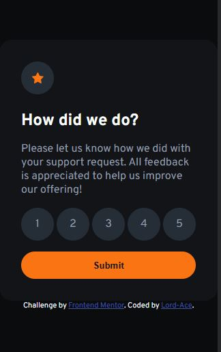

# Frontend Mentor - Interactive rating component solution

This is a solution to the [Interactive rating component challenge on Frontend Mentor](https://www.frontendmentor.io/challenges/interactive-rating-component-koxpeBUmI). Frontend Mentor challenges help you improve your coding skills by building realistic projects. 

## Table of contents

- [Overview](#overview)
  - [The challenge](#the-challenge)
  - [Screenshot](#screenshot)
  - [Links](#links)
- [My process](#my-process)
  - [Built with](#built-with)
  - [What I learned](#what-i-learned)
  - [Continued development](#continued-development)
- [Author](#author)

## Overview

### The challenge

Users should be able to:

- View the optimal layout for the app depending on their device's screen size
- See hover states for all interactive elements on the page
- Select and submit a number rating
- See the "Thank you" card state after submitting a rating

### Screenshot


!

### Links

- Solution URL: [solution to challenge](index.html)
- Live Site URL: [live site](https://interactive-rating-component-blond-rho.vercel.app/)

## My process

### Built with

- Semantic HTML5 markup
- CSS custom properties
- Flexbox
- Mobile-first workflow
- vanilla js

### What I learned

Use this section to recap over some of your major learnings while working through this project. Writing these out and providing code samples of areas you want to highlight is a great way to reinforce your own knowledge.

To see how you can add code snippets, see below:

```js
// DOM (DOCUMENT OBECT MANIPULATION)
score.forEach(choice=>{
    choice.addEventListener('input', function(){
      rate = this.value
    })
  })
  submit.addEventListener('click', function(){
    if(rate==''){
      window.alert('pick a choice')
    } else{
      rateUs.classList.add('hidden')
      overall.textContent = `You selected ${rate} out of 5`
      thankYouState.classList.remove('hidden')
    }
  })
```

### Continued development
to improve on my js, ill focus on mastering DOM and iteracting it with my html and css 
in order to build more interactive and responsive layouts

## Author

- Frontend Mentor - [@yourusername](https://www.frontendmentor.io/profile/lord-ace)
